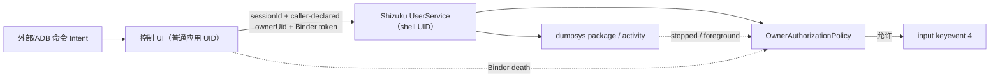
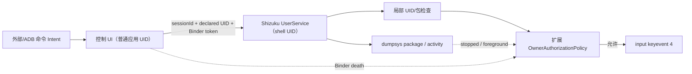
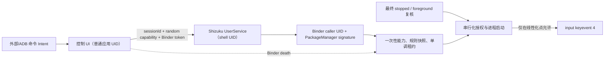
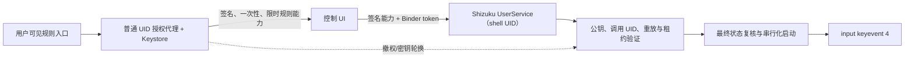

# Security Hardening Proposal: 集中特权会话身份、能力值与最终动作授权

## Decision

状态：**方案 2 已实施，并在固定测试边界通过实体机验证**。

验证结果见 [S0.4 决策](../../decision.md)、[授权与性能报告](../../results/miui14-23078rkd5c-s04-authorization-v004-20260808.report.json)及[生命周期报告](../../results/miui14-23078rkd5c-s04-lifecycle-v004-20260808.report.json)。实测 Back P95 为 `158 ms`，七类生命周期场景全部通过；结论仍受本文“Evidence Coverage And Residual Risk”限制。

## Executive Recommendation

我们有三个真实选项：方案 1“加强 v3 局部检查”保留客户端声明身份并补更多守卫；方案 2“服务端派生身份与一次性能力”把身份、重放、租约和最终动作启动集中到 UserService；方案 3“独立签名授权代理”用普通 UID/Keystore 签发可验证规则能力。

我建议当前固定测试 PoC 采用方案 2。方案 1 的迁移最轻，但未来调用点仍可能绕过约定；方案 3 的长期边界最强，却在没有真实规则存储、用户确认和密钥恢复需求时引入过早的状态与可用性成本。方案 2 可以直接修复我们已经看到的结构性缺口，同时保留升级到方案 3 的接口。

## Evidence

我检查了六份固定证据，其中实体报告证明了生命周期问题与 v3 修复的实际行为，源码则说明剩余控制由谁拥有。

| Evidence | Finding or document | What it establishes |
| --- | --- | --- |
| `E001` | S0.3 v2 force-stop 失败基线 | UI 包 force-stop 后旧 shell 伴侣仍发送一次 Back，说明应用停止与特权授权不是同一生命周期。 |
| `E002` | S0.3 owner-bound v3 通过报告 | owner Binder、stopped 复核和退出协议使 force-stop 后 Back 为 0，并保留断连/重启恢复。 |
| `E003` | v3 AIDL 协议 | `startMonitor` 同时接受客户端提供的 `ownerUid` 与 Binder token。 |
| `E004` | v3 MainActivity | 控制端使用 `Process.myUid()` 和外部关联 session ID 发起监控，但没有独立的一次性能力。 |
| `E005` | v3 OwnerAuthorizationPolicy | 状态机处理 owner death 与崩溃宽限，但不记录已消费 session/capability，也没有独立会话租约。 |
| `E006` | v3 PrivilegedCompanionService | `dispatchBack` 先完成授权判定，再在该判定返回后启动 `input` 进程。 |

观察事实是 `E001` 的失败和 `E002` 的修复结果，以及 `E003`–`E006` 的具体协议结构。由此我们推断：v3 的保护是有效的战术控制，但身份、时限、重放和最终动作线性化仍由多个调用点共同维持，未来动态规则或更多入口会放大控制漂移概率。这个推断不是已利用漏洞的声明，而是 S0.4 选择集中边界的依据。

## Current Design And Failure Mode

控制 UI 以普通应用 UID 运行，Shizuku UserService 以 shell UID 运行。UI 将 session ID、计数、armed、`Process.myUid()` 和 owner Binder token 传给服务。服务相信传入 UID 来确定 Android 用户，owner token 负责生命周期；每次 Back 前读取 stopped 状态，再调用状态机决定是否允许。

v3 对已观察到的 force-stop 失败是有效的：token death 与 stopped 状态使旧伴侣撤权退出。结构上的问题在于，服务没有从 Binder 自身派生调用者身份，session ID 同时承担关联和近似能力标识却没有消费记录，租约只隐含在监控循环超时中，而最终授权返回与 `ProcessBuilder.start()` 之间仍有一个应用内步骤边界。单个问题在固定测试包下风险有限，组合起来却会让真实规则接入时难以证明“谁、依据哪份规则、在什么期限内、只执行哪一次动作”。

## Desired Invariants

- 每次特权会话的 owner UID 只来自 Binder 调用上下文，客户端字段不能改变它；
- owner UID 必须映射到固定 owner 包，且当前安装签名必须可独立解析；
- session ID 与 256 位随机能力值在一个 UserService 进程中最多消费一次；
- 服务端对 owner、来源、目标、动作、数量、模式和租约生成不可变快照哈希；
- 租约使用单调时钟，墙上时间变化不能延长授权；
- 状态未知、身份未知、签名未知、重放、过期、撤权和会话不匹配都拒绝动作；
- 最终 stopped 复核、授权判定和动作进程启动在同一应用内串行化边界完成；
- 任何事件和公开报告都不记录能力明文。

## Constraints And Non-Goals

我们必须保留 Android 9–16 工程基线、Shizuku v13 UserService、固定测试组件、1/10/100 正样本和最多 60 个允许流探针。S0.4 不设计消费者规则 UI，不控制真实第三方包，不执行 Home、force-stop、suspend 或 disable，也不声称能把 Android 的 package stopped 变更与 `input` 调用合并为一个系统事务。

没有发布级性能或内存预算。当前使用 v3 检测/Back/离开 P95 `116/139/211 ms` 作为回归基线，并继续以 250 ms Back P95 作为现有产品门。

## Before Architecture

当前边界如下。值得注意的两条边是“caller-declared ownerUid”和授权返回后的独立 `input` 启动。

源文件见 [before diagram](../diagrams/privileged-authorization-boundary-before.mmd)。这里不存在网络或远程攻击入口；我们关注的是普通 UID 到 shell UID 的本地权限边界及其生命周期。

## Options

### Option 1: 加强 v3 局部检查

方案 1 保留当前 AIDL 和客户端 `ownerUid`，在服务端增加 UID 格式、包名和 session 去重检查，并尽量缩短授权到启动之间的代码。它最吸引人的部分是兼容性：自动化、构造器和状态机都只需小改，回滚也直接。

安全收益是局部的。只要身份仍以调用参数表达，核心不变量仍需要每个调用者“正确填写”；只要检查和启动仍是分离 API，未来调用路径仍可能遗漏最后的复核。我们可以用测试降低当前回归概率，却没有让错误状态在结构上更难表示。该方案适合紧急修补或 Context/PackageManager 在目标 OEM 上无法工作时的临时回退，不适合成为真实规则的最终边界。

源文件见 [Option 1 diagram](../diagrams/privileged-authorization-boundary-strengthen-local-v3-after.mmd)。

| Change | Before | After | Security consequence | Cost |
| --- | --- | --- | --- | --- |
| UID 验证 | 直接使用客户端字段 | 检查字段格式及包映射 | 降低明显错误，但身份仍由参数声明 | 低 |
| 重放 | 无消费记录 | 进程内 session 去重 | 阻止相同 session 重复 | 低 |
| 动作边界 | 判定后单独启动 | 缩短代码距离 | 缩小但不拥有线性化边界 | 低 |

### Option 2: 服务端派生身份与一次性能力

方案 2 删除 AIDL 中的 `ownerUid`。UserService 在 Binder 入口捕获真实 calling UID，通过 v13 Context/PackageManager 验证固定包映射并解析当前签名；客户端只生成一个不进入 Intent、不写日志的 256 位随机能力值。服务端一次性消费 session 与能力，建立带单调租约的不可变规则快照。

最终动作路径由授权状态机拥有一个“验证并启动”操作：它在同一同步边界内读取最后的 stopped 状态、验证 session/capability/租约/revocation，并调用 `ProcessBuilder.start()`。进程输出等待在锁外完成，所以 owner death 不会被整个命令耗时阻塞。这样我们可以把应用内线性化点明确为“最终状态查询成功并在授权锁内启动 input 进程”。Android 在该点之后发生的外部 force-stop 仍不能与 input 合并为系统原子事务，这是必须保留的剩余风险，而不是用更多本地布尔值可以消除的问题。

这个方案不增加进程和持久密钥。会话开始多一次 PackageManager 身份/签名解析；动作路径把既有 dumpsys 查询移入授权锁，预期内存变化仅为小型身份、快照和有界重放集合。它要求 Shizuku v13 Context 构造器在目标设备上可靠，因此我们先做单次身份探针，失败就停止，不通过回信任客户端 UID 来降级。

源文件见 [Option 2 diagram](../diagrams/privileged-authorization-boundary-server-derived-capability-after.mmd)。

| Change | Before | After | Security consequence | Cost |
| --- | --- | --- | --- | --- |
| Owner 身份 | 客户端传 UID | Binder UID + 包映射 + 当前签名 | 调用参数不能伪造 owner 用户或包 | 会话开始一次包管理查询 |
| 会话能力 | session ID | 独立 256 位能力且只记录指纹 | 关联 ID 与授权秘密分离，重放可拒绝 | 有界重放集合 |
| 授权期限 | 循环墙钟超时 | 服务端单调租约 | 改系统时间不能延长授权 | 状态机字段与测试 |
| 规则 | 分散常量和参数 | 不可变快照 SHA-256 | 事件可审计具体授权内容而不泄露能力 | 小量哈希开销 |
| 最终动作 | 判定返回后启动 | 锁内最终复核并启动 | 关闭应用内 check/start 间隙，定义线性化点 | stopped 查询期间延迟 owner 回调 |

### Option 3: 独立签名授权代理

方案 3 把授权创建从 Activity 移到普通 UID 的专用代理。代理只在用户可见规则流程后，用 Android Keystore 私钥签名一次性、限时的规则能力；UserService 固定公钥，验证签名、calling UID、重放和最终状态。它的 strongest case 是未来多入口和持久规则：即使某个 UI 或恢复任务被错误触发，也不能自行改写规则内容或期限，所有创建路径必须经过同一签名策略。

隔离的代价是真实的。我们会新增密钥生成/轮换、备份不可用后的恢复、代理进程死亡、签名版本迁移和时钟/计数器持久化。若私钥仍由同一个易受外部 Intent 驱动的普通应用流程无条件使用，签名只增加形式而不增加用户授权，因此代理还需要明确的用户确认和规则存储边界。当前 PoC 没有这些产品组件，实施会把验证重点从已知 shell 动作边界转移到尚不存在的密钥生命周期。

它仍是值得保留的生产候选。当真实规则可以由多个 Activity、通知动作、恢复流程或自动化入口创建，或者需要跨 UserService 重启拒绝重放时，方案 3 会比进程内能力集合更合适。回滚必须保留双版本验证窗口，直到旧能力全部过期，不能直接删除旧公钥。

源文件见 [Option 3 diagram](../diagrams/privileged-authorization-boundary-signed-policy-broker-after.mmd)。

| Change | Before | After | Security consequence | Cost |
| --- | --- | --- | --- | --- |
| 授权创建 | Activity 直接发起 | 专用代理按用户可见策略签名 | 集中所有规则创建入口 | 新进程与策略 API |
| 跨进程重放 | 仅进程内状态 | 签名能力 + 持久计数/撤销 | 可跨 UserService 重启验证 | 持久状态与恢复复杂度 |
| 密钥 | 无 | Android Keystore 私钥和轮换 | shell 端只能验证、不能签发 | 轮换、迁移、设备恢复负担 |
| 可用性 | UI 与 UserService | 增加代理依赖 | 策略失败与特权执行隔离 | 新的故障点和观测要求 |

## Comparison

下面的方向基于源码与架构推理；只有 v3 基线延迟是已测量数据，S0.4 结果必须重新测量。

| Dimension | Option 1: 局部检查 | Option 2: 服务端能力 | Option 3: 签名代理 |
| --- | --- | --- | --- |
| Security | 改善；仍依赖调用约定 | 明显改善；集中当前特权边界 | 最强的跨入口与跨进程授权，但依赖正确用户策略 |
| Performance | 近似中性；需跑 100 次 | 会话多一次 PM 查询，动作锁内已有 stopped 查询 | 每次授权增加签名/验证与代理 IPC |
| Memory | 中性 | 小型身份、快照和有界 replay set | 新进程、密钥元数据和持久撤销状态 |
| Reliability | 现有行为最稳定，控制漂移仍在 | fail-safe；Context/PM 失败会拒绝会话 | 多一个可用性依赖和恢复路径 |
| Operability | 现有日志略增 | 新增身份来源、能力指纹、快照与租约事件 | 需要密钥轮换、代理健康与签名版本观测 |
| Migration | 最低 | AIDL/UserService v4，单阶段替换 | 多版本能力、公钥与持久状态迁移 |
| Rollback | 直接回退 v3 | 回退 v3，但不得以跳过身份验证作为运行时降级 | 需等待旧能力过期并保留验证公钥 |

方案 2 的主要未知不是 CPU 或内存，而是 UserService Context 在不同 OEM 上的 PackageManager 可用性，以及锁内 stopped 查询对 owner death 响应的尾延迟。我们会在单台目标设备上先验证功能，再用现有 100+15 样本测量；其他 OEM 仍保持未验证。

## Recommendation

在固定测试包、单一控制应用、无持久规则的约束下，我推荐方案 2。它让当前最重要的安全属性由 shell 服务自己拥有，又没有把我们带入尚无产品需求支撑的密钥基础设施。方案 1 只在 v13 Context 无法跨目标平台工作且需要保留研究路径时作为临时选择；即便如此，也必须明确标记身份保证较弱。方案 3 应在真实规则、多入口或跨进程重放成为需求时重新进入设计评审。

若实体机证明 Binder calling UID 不是普通应用 UID，或 v13 Context 无法稳定解析包与签名，我们会停止实施并更新方案，而不是静默采用客户端 UID。若 100 次回归使 Back P95 超过 250 ms，则需要把包状态读取迁移到更直接的系统 Binder API或重新定义动作边界，再决定是否继续。

## Evidence Coverage And Residual Risk

| Evidence | Option 1 | Option 2 | Option 3 | Tactical protection still required |
| --- | --- | --- | --- | --- |
| `E001` — v2 force-stop 失败 | mitigates | addresses at app boundary | addresses at app boundary | S0.3 stopped 复核与退出继续保留 |
| `E002` — v3 生命周期通过 | unaffected/preserved | preserved and extended | preserved and extended | 七类场景必须重跑 |
| `E003` — caller-declared UID | mitigates | addresses | addresses | 固定 owner 包检查 |
| `E004` — 无独立能力 | mitigates | addresses in-process replay | addresses cross-process replay | 能力明文不得记录 |
| `E005` — 无独立租约/重放状态 | mitigates | addresses for UserService lifetime | addresses across service lifetimes | 单调时钟与 bounded state |
| `E006` — check/start 分离 | mitigates | addresses local application gap | addresses local application gap | stopped 与前台二次复核 |

所有方案都无法让 package force-stop 与 `input` 成为一个 Android 系统事务。方案 2/3 只保证：如果撤权或 stopped 状态在线性化点之前可见，动作不会启动；在线性化点之后的系统状态变化属于残余外部竞态。外部命令 Intent 仍是测试自动化入口，不是消费者授权接口；真实产品接入前必须独立收口。

## Migration And Rollout

方案 2 使用 UserService version 4 触发 Shizuku 官方 destroy 清理 v3。首先提交纯状态机、身份解析和协议单元测试，再构建调试 APK；实体机只执行单次身份探针，确认 calling UID、固定包和签名。成功后依次重跑 force-stop、UI crash、Shizuku 断连/恢复、重启/恢复，最后跑 100+15 性能与允许流。

整个 rollout 保持固定测试包和本地 JSONL。任一身份解析、重放、租约、生命周期或性能门失败，都保留 S0.3 已通过报告作为最后有效结论，并把 S0.4 标记为未通过。回滚为代码级恢复 v3；运行时绝不提供“验证失败后信任客户端字段”的开关。

## Validation Plan

- 单元：包/签名身份解析、nonce 格式、重复 session、重复 capability、租约到期、wall clock 无关、旧 death 回调、状态未知和撤权竞态；
- 构建：四模块 `testDebugUnitTest assembleDebug` 与 S0.2 lint；
- 实体身份：ready 事件的 Binder UID 必须等于控制包实际 UID，签名摘要非空；
- 生命周期：S0.3 七类场景全部有效且安全/恢复门通过；
- 性能：正样本 100/100、允许流动作 0/15，Back P95 不超过 250 ms；
- 观测：事件只记录 capability 指纹和规则快照 SHA-256，不记录能力明文；
- 清理：每场结束特权与测试进程 PID 为 0，不隐式恢复 armed。

## Implementation Work Packages

- WP1：AIDL v4 与客户端内部能力生成；
- WP2：Binder calling UID、包映射和签名解析；
- WP3：不可重放 session/capability、规则快照与单调租约；
- WP4：最终状态复核和动作启动的串行化 API；
- WP5：单元、报告和故障注入测试；
- WP6：实体机矩阵、性能证据和 S0.4 决策。

详细顺序、回滚和验收见 [implementation plan](../implementation/server-derived-capability.md)。

## Open Questions

- 产品阶段是否需要跨 UserService 重启拒绝重放，进而采用签名代理或持久计数器；
- 多用户、工作资料和双开下，一个 Linux UID 对应多个包时的签名与规则归属；
- 是否用直接系统 Binder 查询替换 `dumpsys package`，以缩短锁内最终检查；
- 测试自动化 Intent 在进入真实产品前采用签名权限、debug-only 组件还是完全移除。
